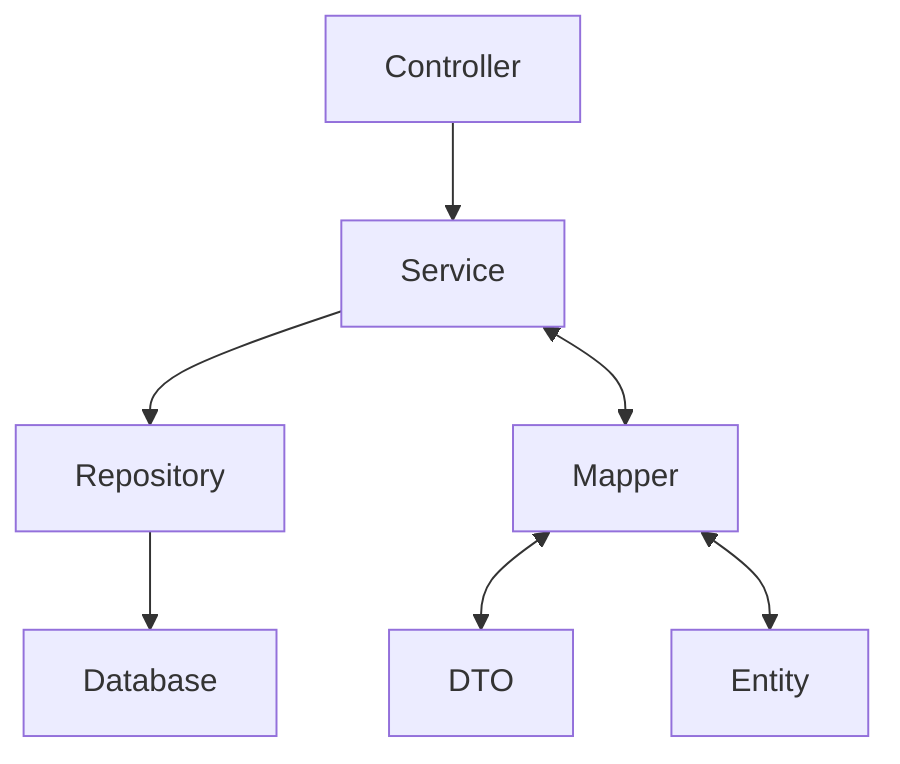

# 📚 CP2 Spring Boot CRUD — Sistema de Autores e Livros

## 🧾 Sumário
- [Descrição Geral](#-descrição-geral)
- [Arquitetura do Projeto](#-arquitetura-do-projeto)
- [Tecnologias Utilizadas](#-tecnologias-utilizadas)
- [Estrutura de Pacotes](#-estrutura-de-pacotes)
- [Banco de Dados H2](#-banco-de-dados-h2)
- [Configurações do Projeto](#-configurações-do-projeto)
- [Como Executar o Projeto](#-como-executar-o-projeto)
- [Endpoints da API](#-endpoints-da-api)
    - [Autores](#autores)
    - [Livros](#livros)
- [Exemplos de Requisições JSON](#-exemplos-de-requisições-json)
- [Testes Automatizados](#-testes-automatizados)
- [Erros Comuns e Soluções](#-erros-comuns-e-soluções)
- [Autora do Projeto](#-autora-do-projeto)
- [Licença Acadêmica](#-licença-acadêmica)

---

## 💡 Descrição Geral

Este projeto foi desenvolvido como parte da **avaliação CP2**.  
Trata-se de uma aplicação **CRUD RESTful** para gerenciar **Autores** e **Livros** com **Java 17** e **Spring Boot 3**.

A arquitetura segue camadas bem definidas:

- **domain**: Entidades JPA (tabelas)
- **dto**: Objetos de transferência de dados (entrada/saída da API)
- **mapper**: Conversão entre Entity ⇄ DTO
- **repository**: Acesso a dados (Spring Data JPA)
- **service**: Regras de negócio
- **Controladores**: Controladores REST (endpoints)

O banco é **H2 em memória**, ideal para desenvolvimento/testes, e os endpoints podem ser validados com **Postman**.

---

## 🏗️ Arquitetura do Projeto



**Benefícios**
- Manutenção simples e baixo acoplamento
- Separação clara de responsabilidades
- Alto nível de testabilidade
- Boas práticas Spring Boot + REST

---

## ⚙️ Tecnologias Utilizadas

| Tecnologia | Descrição |
|---|---|
| ☕ Java 17 | Linguagem principal |
| 🌱 Spring Boot 3.3.3 | Framework para APIs |
| 🗃️ Spring Data JPA | ORM/Persistência |
| 💾 H2 Database | Banco em memória |
| 🧩 Maven | Build/Dependências |
| 🧪 JUnit 5 / Mockito | Testes |
| 🌍 Postman | Teste de endpoints |

---

## 🧱 Estrutura de Pacotes

```plaintext
src/
├── main/
│   ├── java/
│   │   └── com/example/cp2/
│   │       ├── domain/                → Entidades JPA (Author, Book)
│   │       ├── dto/                   → DTOs (AuthorRecord, BookRecord)
│   │       ├── exception/             → Exceções personalizadas
│   │       ├── mapper/                → Conversores entre entidades e DTOs
│   │       ├── repository/            → Spring Data JPA
│   │       ├── service/               → Regras de negócio
│   │       └── controladores/                   → REST Controllers (AuthorController, BookController)
│   └── resources/
│       ├── application.properties     → Configurações principais
│       └── application-test.properties → Configuração de testes (H2 em memória)
└── test/
    └── java/
        └── com/example/cp2/
            ├── AuthorServiceImplTest.java   → Testes de serviço
            ├── MapperTests.java             → Testes de mapeamento
            └── IntegrationApiTest.java      → Testes de integração
```

---

## 🗄️ Banco de Dados H2

Durante a execução, a aplicação usa **H2 em memória**.

### 🔧 `application.properties`
```properties
spring.datasource.url=jdbc:h2:mem:cp2db
spring.datasource.driver-class-name=org.h2.Driver
spring.datasource.username=sa
spring.datasource.password=
spring.jpa.hibernate.ddl-auto=create-drop
spring.jpa.show-sql=true
spring.jpa.properties.hibernate.format_sql=true
spring.h2.console.enabled=true
spring.h2.console.path=/h2-console
```

### 🧠 Como acessar o H2 Console
1. Suba o projeto.
2. Acesse: **http://localhost:8080/h2-console**
3. Em **JDBC URL**, use:
   ```
   jdbc:h2:mem:cp2db
   ```
4. Clique em **Connect**  
   → Tabelas **AUTHOR** e **BOOK** serão criadas pelo Hibernate.

> Nos testes automatizados usamos outra base (`cp2testdb`) para isolamento.

---

## 🔧 Configurações do Projeto

- **Java**: 17
- **Porta padrão**: `8080`
- **Build**: `mvn clean package`
- **Executar**: `mvn spring-boot:run` ou pelo IntelliJ

---

## ▶️ Como Executar o Projeto

```bash
# 1) Clonar o repositório (exemplo)
git clone <seu-repo.git>
cd cp2-spring-boot-crud

# 2) Build
mvn clean package

# 3) Rodar
mvn spring-boot:run
# ou executar a classe com.example.cp2.Cp2Application pelo IDE
```

---

## 🚀 Endpoints da API

Base URL: `http://localhost:8080`

### Autores

#### ➕ Criar Autor — `POST /authors`
```json
{
  "name": "Clarice Lispector",
  "email": "clarice@example.com"
}
```
**201 Created**
```json
{
  "id": 1,
  "name": "Clarice Lispector",
  "email": "clarice@example.com"
}
```

#### 📋 Listar Autores — `GET /authors`
```json
[
  { "id": 1, "name": "Clarice Lispector", "email": "clarice@example.com" },
  { "id": 2, "name": "Machado de Assis", "email": "machado@example.com" }
]
```

#### 🔍 Buscar Autor — `GET /authors/{id}`

#### ✏️ Atualizar Autor — `PUT /authors/{id}`
```json
{
  "name": "Clarice Lispector (Atualizada)",
  "email": "clarice.lispector@example.com"
}
```

#### ❌ Remover Autor — `DELETE /authors/{id}`

---

### Livros

#### ➕ Criar Livro — `POST /books`
```json
{
  "title": "A Hora da Estrela",
  "isbn": "978-85-359-0277-8",
  "authorId": 1
}
```

#### 📋 Listar Livros — `GET /books`
```json
[
  { "id": 1, "title": "A Hora da Estrela", "isbn": "978-85-359-0277-8", "authorId": 1 },
  { "id": 2, "title": "Dom Casmurro", "isbn": "978-85-359-0277-9", "authorId": 2 }
]
```

#### 🔍 Buscar Livro — `GET /books/{id}`

#### ✏️ Atualizar Livro — `PUT /books/{id}`
```json
{
  "title": "A Hora da Estrela (Edição Revisada)",
  "isbn": "978-85-359-0277-8",
  "authorId": 1
}
```

#### ❌ Remover Livro — `DELETE /books/{id}`

#### 📚 Listar livros de um autor — `GET /authors/{id}/books`
```json
[
  { "id": 1, "title": "A Hora da Estrela", "isbn": "978-85-359-0277-8", "authorId": 1 }
]
```

---

## 🧩 Exemplos de Requisições JSON

**Autor**
```json
{ "name": "Machado de Assis", "email": "machado@example.com" }
```

**Livro**
```json
{ "title": "Dom Casmurro", "isbn": "978-85-359-0277-9", "authorId": 2 }
```

---

## 🧪 Testes Automatizados

Cobrem:
- CRUD de autores e livros
- Integração da API com contexto Spring
- Mapeamentos Entity ⇄ DTO

Ferramentas:
- **JUnit 5**, **Mockito**, **Spring Boot Test**

Executar:
```bash
  mvn test
```

---

## ⚠️ Erros Comuns e Soluções

| Erro | Causa | Solução |
|---|---|---|
| 500 — Internal Server Error ao criar livro | `authorId` não existe | Crie primeiro o autor ou use um `authorId` válido |
| 404 — Not Found | ID não encontrado | Verifique se o registro existe |
| Não conecta no H2 Console | URL errada | Use `jdbc:h2:mem:cp2db` |
| Erro de plugin Maven | Dependências/repo local | `mvn clean install -U` e reimport no IDE |

---

## 👩‍💻 Autora do Projeto

**Maria Eduarda Araujo Penas**  
📧 eduarda.penas@example.com  
💻 CP2 — Desenvolvimento Web com Spring Boot

---

## 📜 Licença Acadêmica

Projeto feito para **fins educacionais** (CP2).  
Você pode estudar, melhorar e reutilizar com finalidade acadêmica.
